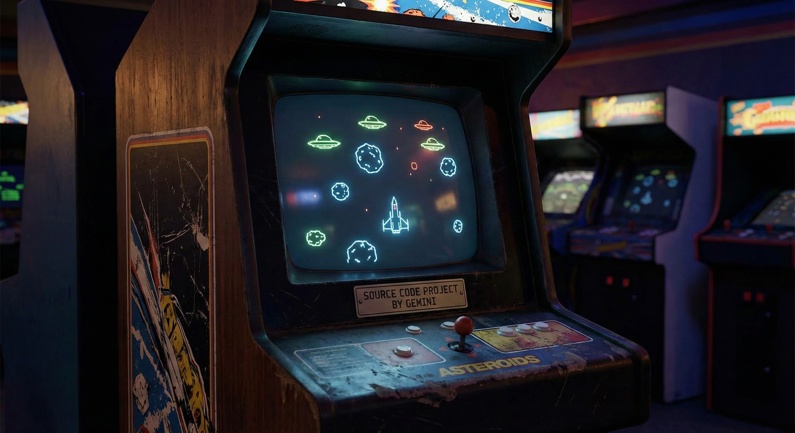

# Asteroids Clone (Go with Ebitengine)



This is a classic Asteroids arcade game clone implemented in Go using the Ebitengine (formerly Ebiten) game library. The project aims to replicate the look, feel, and core mechanics of the original 1979 game, including vector-style graphics, ship inertia, screen-wrapping, and splitting asteroids.

This project was developed interactively using the Gemini CLI, leveraging the capabilities of Gemini 3 for code generation, modifications, and project management.

## Features Implemented:
-   **Classic Asteroids Gameplay**: Navigate your spaceship, shoot asteroids, and avoid collisions.
-   **Splitting Asteroids**: Larger asteroids break into smaller pieces when shot.
-   **Screen Wrapping**: Objects moving off-screen reappear on the opposite side.
-   **UFOs**: Two types of flying saucers appear periodically, firing at the ship.
    -   "Big saucer" shoots randomly and poorly.
    -   "Small saucer" fires frequently with increasing accuracy as score rises.
    -   After 40,000 points, only the small saucer appears.
-   **Scoring**: Points awarded for destroying asteroids and UFOs.
-   **Level Progression**: New levels start with more asteroids once the screen is clear.
-   **Player Lives**: Start with 3-5 lives, gain an extra life every 10,000 points.
-   **Ship Explosion**: When hit, the ship explodes into debris before respawning (if lives remain) or triggering Game Over.

## How to Run:

1.  **Prerequisites**: Ensure you have Go installed (https://golang.golang.org/doc/install).
2.  **Clone the repository**:
    ```bash
    git clone https://github.com/scottdensmore/asteroids.git
    cd asteroids
    ```
3.  **Run the game**:
    ```bash
    go run .
    ```

## Controls:
*   **Left / Right Arrow:** Rotate Ship
*   **Up Arrow:** Thrust
*   **Space:** Fire
*   **Enter:** Restart Game (when Game Over)
